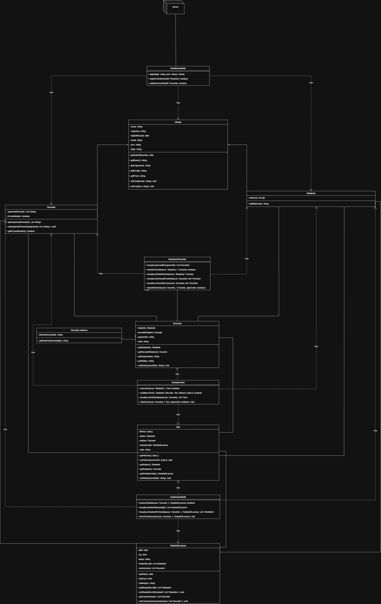

# Documentazione Progetto  
## 📑 Indice della Documentazione

* [1. Traccia](Traccia2.pdf)
* [2. Metodologie di Approccio](#metodologie-di-approccio)
* [3. Analisi Delle Classi](#analisi-delle-classi)
* [4. Breakdown Delle Classi](#breakdown-delle-classi)
* [5. Progettazione UML](#progettazione-uml)

---

# Metodologie di Approccio

### Indice della Sezione
* [1. Domande e Ambiguità](#1-domande-e-ambiguità)
* [2. Criticità Architetturali](#2-criticità-architetturali)
* [3. Refactoring Completato](#3-refactoring-completato)

---

## 1. Domande e Ambiguità

| Quesito | Stato |
|---------|-------|
| Tutti i docenti sono relatori? | [Risolto](#domande---risposta-1) |
| Il docente ha una matricola/anno immatricolazione? | [Risolto](#domande---risposta-2) |
| Cosa si intende con "login"? | [Risolto](#domande---risposta-3) |

### Domande - Risposta 1: Tutti i docenti sono relatori?

Sì, non esiste alcuna differenza tra relatori e docenti, sono una cosa unica.

### Domande - Risposta 2: Il docente ha una matricola?

Il docente ha un suo identificativo univoco non collegato alla matricola del comune studente, di conseguenza non può avere un anno di immatricolazione.

### Domande - Risposta 3: Cosa si intende con login?

Possiamo definire il login non come il termine reale (l'azione di inserire mail e password o id su un sito per accedere) ma bensì come un attributo singolo e atomico (ovvero non composto; perché lo intendiamo come nominativo per l'accesso).

---

## 2. Criticità Architetturali

L'UML iniziale violava il requisito di "modello di dominio puro" presentando le seguenti difformità rispetto alla documentazione:

### Problemi Principali Rilevati:

1. **Classi architetturali presenti**: Server, GestioneUtenza, GestioneTirocinio, GestioneTesi, GestioneLaurea (non previste)
2. **Classi di dominio mancanti**: Richiesta Tirocinio (collassata in Tirocinio), Prenotazione Seduta (collassata in lista)
3. **Metodi rimossi dalle entità** e spostati ai controller (anemic domain model)
4. **Attributi mancanti**: Oltre 12 attributi mancanti, tra cui idTirocinio, corsoDiLaurea, cfuMaturati/DaMaturare, postiDisponibili, ecc.

### Impatti Critici:

- Perdita di tracciabilità storica (prenotazioni, richieste)
- Entità di dominio senza comportamento (getter/setter only)
- Confusione semantica tra Tirocinio e RichiestaTirocinio
- Perdita di controllo sulla capienza delle sedute
- Informazioni aziendali non tracciabili (referente aziendale)

---

## 3. Refactoring Completato: Pattern Anemic Domain Model

Per risolvere le criticità sopra citate, è stato applicato rigorosamente il pattern Modello Anemico. Ecco gli interventi effettuati:

### Entità Pulite

È stata rimossa tutta la logica di business dalle classi di dominio:

- **Docente.java** - Rimossi `pubblicaArgomentoTirocinio()`, `valutaRichiestaTirocinio()`, `valutaTesi()`
- **Studente.java** - Rimossi `richiediTirocinio()`, `caricaTesi()`, `prenotaSedutaLaurea()`
- **Tesi.java** - Rimossi `richiediRevisione()`, `approvaTesi()`
- **PrenotazioneSeduta.java** - Rimosso `confermaPrenotazione()`

### Manager/Service Creati

- **TirocinioManager.java** - Gestisce la logica dei tirocini
- **RichiestaTirocinioManager.java** - Crea e valuta richieste
- **TesiManager.java** - Gestisce caricamento, revisione e approvazione tesi
- **PrenotazioneManager.java** - Crea e conferma prenotazioni

### TestModel.java Aggiornato

Il file di test è stato riorganizzato per dimostrare l'uso corretto dei Manager:

- Sezioni chiaramente divise per funzionalità
- Istanziazione di Manager per ogni operazione di business logic
- Output organizzato con commenti esplicativi

### Struttura Finale Ottenuta:

- ✅ **Entità** = Soli dati + getter/setter minori
- ✅ **Manager** = Tutta la logica di business
- ✅ **TestModel** = Dimostra il flusso applicativo completo

---

# Analisi Delle Classi

I principali utilizzatori sono:
Studenti e Docenti.

Ogni studente deve avere:
- Un Nome
- Un Cognome
- Una E-Mail
- Una Matricola [che ci servirà come identificativo]
- Login
- Password

Inoltre lo studente può:
- Vedere l'elenco dei docenti con annessi argomenti disponibili
- Effettuare una richiesta di tirocinio
- Controllare se la propria richiesta è accettata o respinta
- Effettuarne una nuova nel caso fosse stata respinta
- Effettuare il caricamento/richiesta della tesi nel caso fosse stata approvata
- Chiedere la revisione in caso di rifiuto

Ogni Docente, in maniera praticamente analoga, deve avere:
- Un Nome
- Un Cognome
- Una E-Mail
- ID_Doc [che ci servirà come identificativo]
- Login
- Password
- Tirocinio (possibile tabella esterna dotata di argomenti di tirocinio che può possedere: [I tirocini possono essere interni o esterni. I tirocini esterni sono in collaborazione con aziende e per essi viene indicato anche il nominativo di referenza aziendale])

Il docente può avere la possibilità di essere coordinatore, risolvibile con un attributo es. `is_coo` di tipologia booleana (1 per vero, 0 per falso). 

# BREAKDOWN DELLE CLASSI

### Indice della Sezione
* [Gerarchia Utenti](#gerarchia-utenti)
* [Gestione Tirocini e Tesi](#gestione-tirocini-e-tesi)
* [Gestione Laurea](#gestione-laurea)

---

## Gerarchia Utenti

#### 👤 Utente (Superclasse)
La classe principale da cui derivano le due specializzazioni **Studente** e **Docente**.

##### Attributi (Utente)

| Attributo | Tipo | Chiave Primaria | Descrizione |
|-----------|------|----------|-------------|
| `nome` | String |  | Nome dell'utente |
| `cognome` | String |  | Cognome dell'utente |
| `dataDiNascita` | LocalDate |  | Data di nascita dell'utente |
| `email` | String |  | Email dell'utente |
| `login` | String |  | Nominativo per l'accesso al sistema |
| `password` | String |  | Password per l'autenticazione |

##### Metodi (Utente)

| Metodo | Parametri | Ritorno | Descrizione |
|--------|-----------|---------|-------------|
| `effettuaLogin(password)` | String password | boolean | Verifica se la password inserita è corretta |
| `modificaPassword(nuovaPassword)` | String nuovaPassword | void | Modifica la password dell'utente |
| Getter e Setter | - | - | Metodi per accedere e modificare gli attributi |

#### 🎓 Studente (Specializzazione di Utente)

##### Attributi (Studente)

| Attributo | Tipo | Chiave Primaria | Descrizione |
|-----------|------|----------|-------------|
| `matricola` | String | true | Identificativo univoco dello studente |
| `corsoDiLaurea` | String | false | Denominazione del corso di laurea |
| `cfuMaturati` | Integer | false | Crediti formativi universitari acquisiti |
| `cfuDaMaturare` | Integer | false | Crediti formativi universitari rimanenti |
| `annoImmatricolazione` | Year | false | Anno di iscrizione al corso |

##### Metodi (Studente)

| Metodo | Parametri | Ritorno | Descrizione |
|--------|-----------|---------|-------------|
| `richiediTirocinio(tirocinio)` | Tirocinio t | RichiestaTirocinio | Crea una nuova richiesta di tirocinio |
| `caricaTesi(tesi)` | Tesi t | void | Carica una tesi nel sistema |
| `prenotaSedutaLaurea(seduta)` | SedutaLaurea s | PrenotazioneSeduta | Crea una prenotazione per una seduta di laurea |
| Getter e Setter | - | - | Metodi per accedere e modificare gli attributi |

#### 👨‍🏫 Docente (Specializzazione di Utente)
Include anche il ruolo di Relatore per i tirocini seguiti.

##### Attributi (Docente)

| Attributo | Tipo | Chiave Primaria | Descrizione |
|-----------|------|----------|-------------|
| `idDocente` | String | true | Identificativo univoco del docente |
| `isCoordinatore` | Boolean | false | Indica se il docente è coordinatore di corso |

##### Metodi (Docente)

| Metodo | Parametri | Ritorno | Descrizione |
|--------|-----------|---------|-------------|
| `pubblicaArgomentoTirocinio(tirocinio)` | Tirocinio t | void | Pubblica un nuovo argomento di tirocinio |
| `valutaRichiestaTirocinio(richiesta, esito)` | RichiestaTirocinio r, boolean esito | void | Valuta l'approvazione/rifiuto di una richiesta |
| `valutaTesi(tesi, approvata)` | Tesi t, boolean approvata | void | Valuta l'approvazione di una tesi |
| Getter e Setter | - | - | Metodi per accedere e modificare gli attributi |

---

## Gestione Tirocini e Tesi

### Indice della Sezione
* [Tirocinio](#tirocinio-unifica-argomento-e-tirocinio)
* [Tirocinio Esterno](#tirocinio-esterno-specializzazione-di-tirocinio)
* [Richiesta Tirocinio](#richiesta-tirocinio)
* [Tesi](#tesi)

#### 💼 Tirocinio (Unifica "Argomento" e "Tirocinio")

##### Attributi (Tirocinio)

| Attributo | Tipo | Chiave Primaria | Descrizione |
|-----------|------|----------|-------------|
| `idTirocinio` | String | true | Identificativo univoco del tirocinio |
| `argomento` | String | false | Tema/argomento del tirocinio |
| `totaleOre` | Integer | false | Numero totale di ore previste |
| `docenteProponente` | Docente | false | Docente che propone il tirocinio |

##### Metodi (Tirocinio)

| Metodo | Parametri | Ritorno | Descrizione |
|--------|-----------|---------|-------------|
| `getDettagliTirocinio()` | - | String | Restituisce i dettagli formattati del tirocinio |
| Getter e Setter | - | - | Metodi per accedere e modificare gli attributi |

#### 🏢 Tirocinio Esterno (Specializzazione di Tirocinio)

##### Attributi (Tirocinio Esterno)

| Attributo | Tipo | Chiave Primaria | Descrizione |
|-----------|------|----------|-------------|
| `aziendaSeguita` | String | false | Nome dell'azienda ospitante |
| `referenteAziendale` | String | false | Nominativo della persona di riferimento in azienda |

##### Metodi (Tirocinio Esterno)

| Metodo | Parametri | Ritorno | Descrizione |
|--------|-----------|---------|-------------|
| Getter e Setter | - | - | Metodi per accedere e modificare gli attributi specifici |

#### 📝 Richiesta Tirocinio
Classe che gestisce la candidatura di uno studente per un determinato tirocinio.

##### Attributi (Richiesta Tirocinio)

| Attributo | Tipo | Chiave Primaria | Descrizione |
|-----------|------|----------|-------------|
| `idRichiesta` | String | true | Identificativo univoco della richiesta (formato: REQ-timestamp) |
| `studenteRichiedente` | Studente | false | Riferimento allo studente che presenta la richiesta |
| `tirocinioRichiesto` | Tirocinio | false | Riferimento al tirocinio richiesto |
| `dataInizio` | LocalDate | false | Data in cui è stata creata la richiesta |
| `statoRichiesta` | String | false | Stato della richiesta: "In Attesa", "Approvata", "Respinta" |

##### Metodi (Richiesta Tirocinio)

| Metodo | Parametri | Ritorno | Descrizione |
|--------|-----------|---------|-------------|
| `aggiornaStato(nuovoStato)` | String nuovoStato | void | Aggiorna lo stato della richiesta se il valore è valido |
| Getter e Setter | - | - | Metodi per accedere e modificare gli attributi |

#### 📚 Tesi
Rappresenta il lavoro finale caricato dallo studente.

##### Attributi (Tesi)

| Attributo | Tipo | Chiave Primaria | Descrizione |
|-----------|------|----------|-------------|
| `idTesi` | String | true | Identificativo univoco della tesi |
| `titolo` | String | false | Titolo della tesi |
| `percorsoFile` | String | false | Percorso o URL al file della tesi (PDF/documento) |
| `autore` | Studente | false | Riferimento allo studente autore |
| `relatore` | Docente | false | Riferimento al docente relatore |
| `statoApprovazione` | String | false | Stato: "Bozza", "Revisione", "Approvata" |

##### Metodi (Tesi)

| Metodo | Parametri | Ritorno | Descrizione |
|--------|-----------|---------|-------------|
| `richiediRevisione()` | - | void | Cambia lo stato da "Bozza" a "Revisione" |
| `approvaTesi()` | - | void | Approva la tesi impostando lo stato a "Approvata" |
| Getter e Setter | - | - | Metodi per accedere e modificare gli attributi |

---

## Gestione Laurea

### Indice della Sezione
* [Seduta di Laurea](#seduta-di-laurea)
* [Prenotazione Seduta](#prenotazione-seduta)

#### 🎓 Seduta di Laurea
Rappresenta l'evento in cui avvengono le discussioni delle tesi.

##### Attributi (Seduta di Laurea)

| Attributo | Tipo | Chiave Primaria | Descrizione |
|-----------|------|----------|-------------|
| `idSeduta` | String | true | Identificativo univoco della seduta |
| `dataSeduta` | LocalDate | false | Data della seduta di laurea |
| `orarioInizio` | LocalTime | false | Orario di inizio della seduta |
| `aula` | String | false | Denominazione dell'aula in cui si svolge |
| `postiDisponibili` | Integer | false | Numero di posti disponibili nella seduta |

##### Metodi (Seduta di Laurea)

| Metodo | Parametri | Ritorno | Descrizione |
|--------|-----------|---------|-------------|
| `verificaDisponibilita()` | - | boolean | Verifica se ci sono posti disponibili |
| `decrementaPosti()` | - | void | Decrementa il numero di posti disponibili |
| Getter e Setter | - | - | Metodi per accedere e modificare gli attributi |

#### 📅 Prenotazione Seduta
Gestisce l'inserimento dello studente all'interno di una seduta disponibile.

##### Attributi (Prenotazione Seduta)

| Attributo | Tipo | Chiave Primaria | Descrizione |
|-----------|------|----------|-------------|
| `idPrenotazione` | String | true | Identificativo univoco della prenotazione (formato: PREN-timestamp) |
| `studente` | Studente | false | Riferimento allo studente che prenota |
| `seduta` | SedutaLaurea | false | Riferimento alla seduta di laurea |
| `dataPrenotazione` | LocalDate | false | Data in cui è stata effettuata la prenotazione |

##### Metodi (Prenotazione Seduta)

| Metodo | Parametri | Ritorno | Descrizione |
|--------|-----------|---------|-------------|
| `confermaPrenotazione()` | - | boolean | Conferma la prenotazione e decrementa i posti se disponibili |
| Getter e Setter | - | - | Metodi per accedere e modificare gli attributi |

---

# PROGETTAZIONE UML
